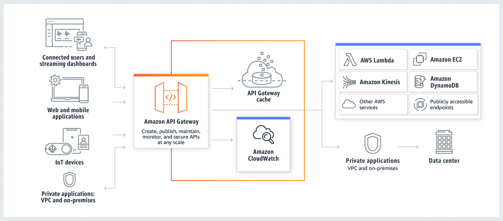
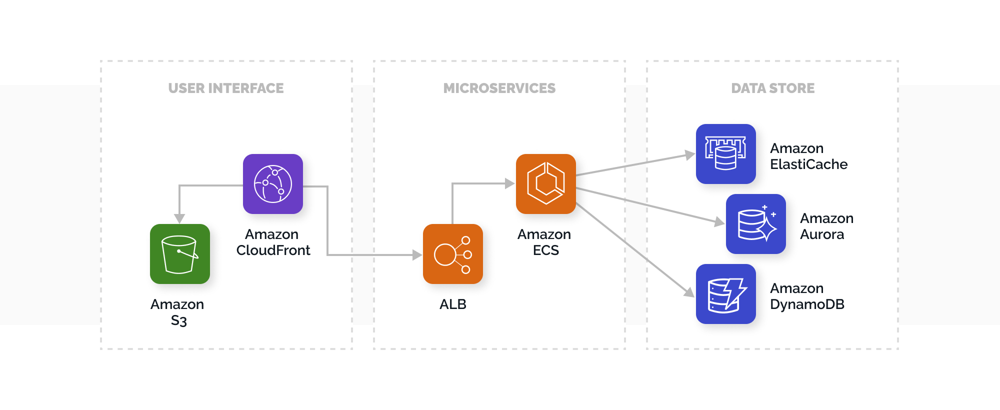

# AWS
## Route 53
This is the entry of AWS, provide Domain Name System (DNS) web services.  We can set two types host zone, public for outsite url and private for VPC connect. A public hosted zone is a container that holds information about how you want to route traffic on the internet for a specific domain whereas a private hosted zone is a container to records for a domain that you host in Amazon virtual private clouds (VPCs).  We use public host zone to route traffic to a CloudFront distribution or a web server in data center. [DNS and LocalDNS](/docs/ComputerNetworking/extra#dns)

## CloudFront
CloudFront is the AWS content delivery network (CDN), which can deliver your entire website by using a global network of edge locations. We setting /api/.. to origin service, and for default request, they are set to S3-web-frontend.  

   
And Lambda@Edge lets you run Node.js and Python Lambda functions to customize content that CloudFront delivers, executing the functions in AWS locations closer to the viewer. For example, we can get languege code from URL, set /ui, /sitemap request.uri to certain uri, and check .js, .css, .woff,. svg request, then do routing or redirect on common request.  

## API Gateway
 
 This enables you to create and deploy your own REST, HTTP and WebSocket APIs. (REST APIs and HTTP APIs are both RESTful API products. REST APIs support more features than HTTP APIs. ) It act as a "front door" for applications to access data, business logic, or functionality from your backend services. You can bind lamda to certain request, like for PDF generate service, when user access to /pdf url, we will call pdf data service lamda.   
 Also to enable serverless applications, API Gateway supports streamlined proxy integrations with AWS Lambda and HTTP endpoints, we usally set up proxy on HTTP API.  
We will set a Network Load Balancer (NLB) for API Gateway private integrations. Elastic Load Balancing automatically distributes your incoming traffic across multiple targets, such as EC2 instances, containers, and IP addresses, in one or more Availability Zones. It works with EC2 and EC2 auto scaling, to run multiple containers and distributes traffic to them.

## VPC
A virtual private cloud (VPC) is a virtual network in your own logically isolated area in the AWS Cloud, which provides Console, CLI, SDKs and Query APIs. We use security group acts as a virtual firewall, controlling the traffic that is allowed to reach and leave the resources. We can set  inbound and outbound IP and port, usually for HTTPS 443. 

## CodePipeline

  
AWS CodePipeline, is a fully managed continuous delivery service that helps to automate the release pipelines for fast and reliable application and infrastructure updates. CodePipeline automates the build, test, and deploy phases of the release process every time there is a code change, based on the release model you define.   
Usually we just use CodeBuild compiles the source code, runs unit tests, and produces artifacts that are ready to deploy.  

## Architecture on AWS

- Public network(User Interface): Route 53, CloudFront, S3
- Private network(certain IP Segment): Microservice(ECS, ALB), Database(noSQL and mySQL)
- S3: hosting static web content as a network disk, Front-end use it's code build/deploy API to deploy code to target sites. 
- Amazon ECS: A highly scalable and fast container management service used primarily to orchestrate Docker containers . It's integrated with both Web Information Service and third-party tools(For using docker, Install it on EC2, then create a Docker Images and upload to ECR which manage AWS Docker registry service). In essence, Amazon ECS is a logical grouping or cluster of EC2 instances that act as a Docker host. ECS needs EC2 instances to underpin it.  And with AWS Fargate we can use ECS to run docker containers without having to manage servers or clusters of Amazon EC2 instances. 
- Amazon Elastic Compute Cloud (Amazon EC2): provides scalable computing capacity and enables applications to run on AWS, it contains virtual computing environments and various configurations of CPU, memory, storage, and networking capacity for instances, which means it can launch many virtual servers, configure security and networking, and manage storage. 
- Amazon ECS service can optionally be configured to use Auto Scaling, which provide the ability to increase or decrease the desired count of tasks in your Amazon ECS service automatically. 
- Database: Usually we use noSQL for data that don't have relationships with other tables and has multiple levels. Like fund data, which contains many hierarchy and plenty column for each fund, but we only need to display it, so it's an unnecessary cost to build up relational tables. And we use another relational database like mySQL to storage other data. Both of them are on amazon data store.

## Why we use cloud
- Using AWS tools, Auto Scaling, and Elastic Load Balancing, your application can scale up or down based on demand, No need to maintence local server.
- Using global computing infrastructure and CDN acceleration.
- Having reliable security service including using virtual firewall.
- Provide CI/CD tools, lamda, DNS and other network management tools, reduce uneccessary cost and let developer focus on delivery.
- With ECS(Containers) and lamda(Serverless) we can easily build up Microservices(processes are tightly coupled and run as a single service) Architecture.