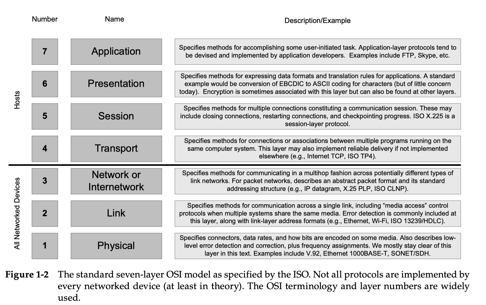
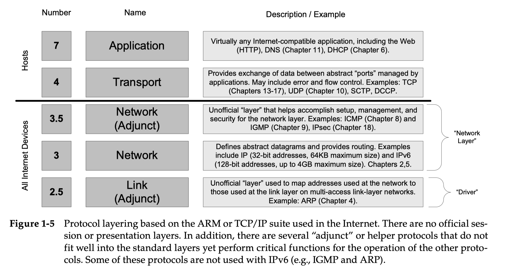
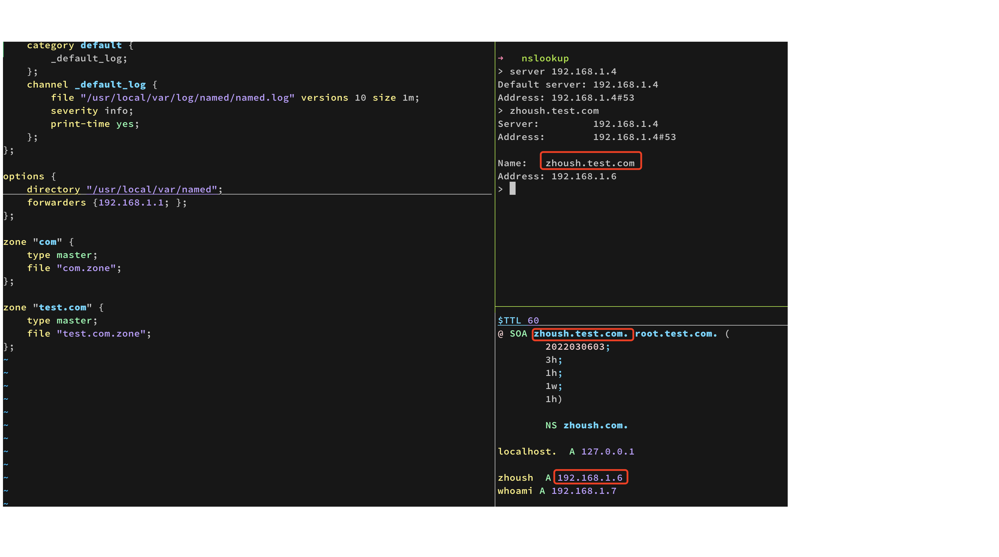
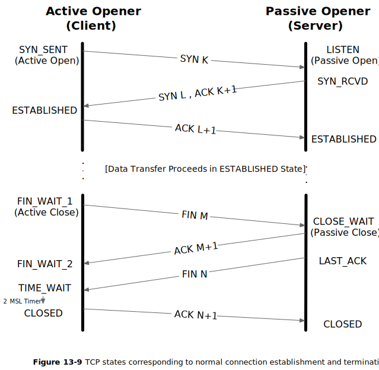
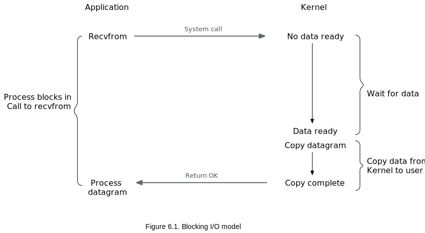
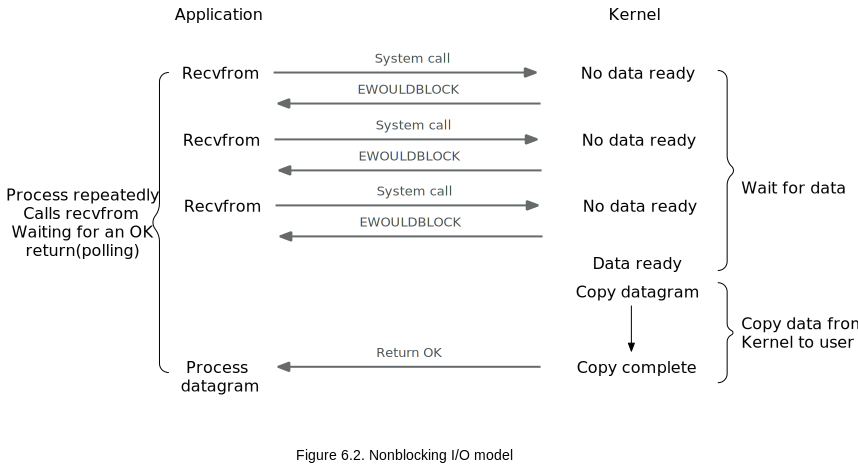
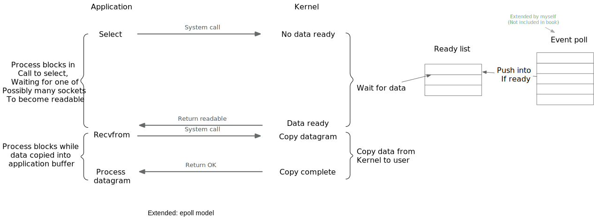

# Computer Networking Extra

## Layer
  


## DNS
- DNS (Domain Name System) is a distributed client/server networked database that is used by TCP/IP applications to map between host names and IP addresses. You can use nslookup to search a domain name, and it will return True IP Adress. You can manually change your DNS server like 192.101.4.3 to use local DNS server for finding LAN(local area network) IP adress.
- Name Space: the set of all names used with DNS constitutes the DNS _name space_. hierarchically, case insensitive, a tree of domains with an unnamed root at the top.
- Zone: the unit of administrative delegation, the subtree of domain name space, for example server01.example.com, server01 is the hostname, and example.com may be the  zone (com also can be the zone, decided by your separate setting). When you have multi server, you can assign request to certain server by using hostname+zone, or simply use zone to let cloud do distribution. On AWS, route 53 is a DNS service including private zone using local DNS server, it's called 53 due to DNS use port:53.
- Cache:  Name servers can obtain the information directly from the zone database, the result of a zone transfer (master -> slave), or from another server in the course of processing resolution. Most name servers _cache_ zone information they learn, up to a time to live (_TTL_). They use this cached information to answer queries.
- Local DNS: If you didn't assign URL to specified IPs and have DNS served, usually when you send request by typing a URL on browser, the domain name will be send to DNS server on Internet and it will mapping IP adress, and then route you request to destination server. But when you using local DNS service like AWS private zone, your domain name will be sent to local DNS server and it will find IP adress on VPC(your private network on cloud), and directly route your request to zone server. To prevent a request don't have a handleing zone, we can set a root zone like .com or redirect request to another DNS server.  
Below is a tesing local DNS server, it will return local IP adress when you search domain name.


## TCP
- TCP and UDP have 4-tuple: source ip, destination ip, source port, destination port. While on IP level there's no port.
- Half-close: close only a single direction of the data flow.
  

## I/O Multiplexing
TCP connection is not blocking, actually it's I/O is using Linux Epoll Model.   
If the sever don't response while wating for data, the request is blocking.   

 
On below figure, client is trying to request data, whereas the server send back response to tell client data is not ready yet, and return OK when it's ready. On this case the I/O can be repeatlly called, so it's much more better. 

 
To better support multi I/O, Epoll use a event poll to handle all request in a queue, and it will put ready data to the ready list which client can take later. This gives TCP ability to handle mulity I/O request, and I think this is also why HTTP2.0 can be realized.

 
If you see fd(file descriptor) list, that's because on Linux everything is a file, and socket is a kind of descriptor link to the entry of file table.

## Restful API
1. REST is an acronym for Representational State Transfer and an architectural style for distributed hypermedia systems. Below are all legal RestFul API format.
```js
/devices
/devices/{id}
/configurations
/configurations/{id}
/devices/{id}/configurations
/devices/{id}/configurations/{id}
```
```js
HTTP GET /devices?startIndex=0&size=20
HTTP PUT /devices/{id}/configurations
HTTP DELETE /devices/{id}/configurations/{id}
```
```js
<devices size="2">
	<link rel="self" href="/devices"/>
	<device id="12345">
	<link rel="self" href="/devices/12345"/>
	<id>12345</id>
	<deviceFamily>apple-es</deviceFamily>
	<OSVersion>10.0R2.10</OSVersion>
	<platform>SRX100-LM</platform>
	<serialNumber>32423457</serialNumber>
	<name>apple-srx_100_lehar</name>
	<hostName>apple-srx_100_lehar</hostName>
	<ipAddr>192.168.21.9</ipAddr>
	<status>active</status>
	<configurations size="2">
		<link rel="self" href="/configurations" />
		<configuration id="42342">
			<link rel="self" href="/configurations/42342" />
		</configuration>
		<configuration id="675675">
			<link rel="self" href="/configurations/675675" />
		</configuration>
	</configurations>
	<method href="/devices/12345/exec-rpc" rel="rpc"/>
	<method href="/devices/12345/synch-config"rel="synch device configuration"/>
</device>
	</device>
	<device id="556677">
		...
	</device>
</devices>
```
2. Difference between each methods  
- GET(Read): The HTTP GET method is used to read (or retrieve) a representation of a resource. In the “happy” (or non-error) path, GET returns a representation in XML or JSON and an HTTP response code of 200 (OK). In an error case, it most often returns a 404 (NOT FOUND) or 400 (BAD REQUEST). According to the design of the HTTP specification, GET (along with HEAD) requests are used only to read data and not change it. 
Do not expose unsafe operations via GET—it should never modify any resources on the server.
- Put(Update/Replace): PUT method requests for the attached entity (in the request body) to be stored into the server, like PUT /questions/{question-id}. PUT method is idempotent. So if we retry a request multiple times, that should be equivalent to a single request invocation. Use PUT when we want to modify a singular resource that is already a part of resources collection. Though PUT is idempotent, we should not cache its response. Generally, in practice, use PUT for UPDATE operations.
- POST(Create): POST request-URI should be of a collection URI, like POST /questions. POST is NOT idempotent. So if we retry the request N times, we will end up having N resources with N different URIs created on the server. Use POST when you want to add a child resource under resources collection. Responses to this method are not cacheable, unless the response includes appropriate Cache-Control or Expires header fields. Always use POST for CREATE operations.
- DELETE: Meaning defined as "delete the entire collection". On successful deletion, return HTTP status 200 (OK) along with a response body, perhaps the representation of the deleted item (often demands too much bandwidth), or a wrapped response (see Return Values below). Either that or return HTTP status 204 (NO CONTENT) with no response body. In other words, a 204 status with no body, or the JSEND-style response and HTTP status 200 are the recommended responses.
- PATCH(Update/Modify): PATCH is used for modify capabilities. The PATCH request only needs to contain the changes to the resource, not the complete resource. This resembles PUT, but the body contains a set of instructions describing how a resource currently residing on the server should be modified to produce a new version. This means that the PATCH body should not just be a modified part of the resource, but in some kind of patch language like JSON Patch or XML Patch.

3. Caching  
Caching is the ability to store copies of frequently accessed data in several places along the request-response path. When a consumer requests a resource representation, the request goes through a cache or a series of caches (local cache, proxy cache, or reverse proxy) toward the service hosting the resource. By using HTTP headers, an origin server indicates whether a response can be cached and, if so, by whom, and for how long.  
GET:requests should be cachable by default – until a special condition arises. Usually, browsers treat all GET requests as cacheable.  
POST:requests are not cacheable by default but can be made cacheable if either an Expires header or a Cache-Control header with a directive, to explicitly allows caching, is added to the response.  
Responses to PUT and DELETE requests are not cacheable at all.  
Please note that HTTP dates are always expressed in GMT, never in local time.  
Note that no-cache does not mean "don't cache". no-cache allows caches to store a response but requires them to revalidate it before reuse. If the sense of "don't cache" that you want is actually "don't store", then no-store is the directive to use.
```js
Cache-Control: max-age=604800 no-cache no-store
```
