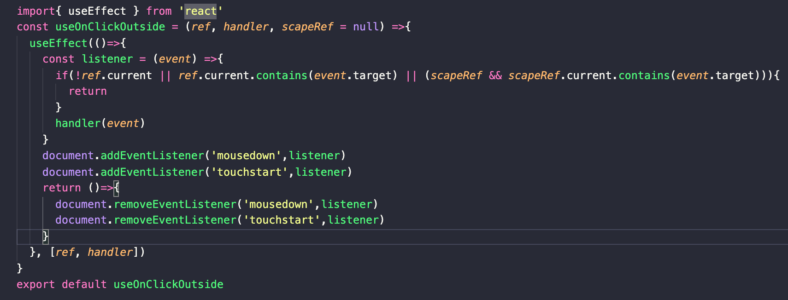
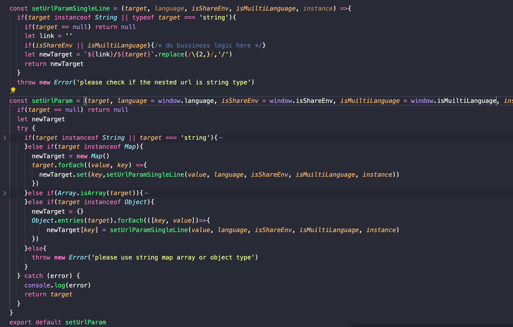

# Front End Core
### Technology Stack
- The old Front-end project is based on handlebar.js and mariontte.js, which simplifies Backbone application code with robust views and architecture solutions including router. Then we add react as mariontte child view, and build all new features with react/redux. And on next-stage FE project which was also on development, we use react and rxjs. Both project choose flow.js as static type checker, and sass as css extension, we also use storybook, webpack, highchart.js. On old project we use foundation based sass library doing cutomized abstract varibles and mixins, and we have diferrent theming.
- After dalian team take over, we build a react form widgets using formik, provide components including selectBox, checkBox, inpt, button, radio, textArea and so on. And all components are wrapped with HOC to provide error handling and validation services. We also create a react wrapper service base on marionette, using bundle-loader to load moudules and chart depenedencies, and onAttach() call react render method to createFactory as entry view and onDestoty() call react dom unmountComponentAtNode, so all new react components can be managed in react-adapter and easy to migrate to new project.
- Personaly, I also did some common react hooks like useDebouce, useOnClickOutside, useOnKeyPress and so on. And added some common methods including mobile/ touch-device check, local storage expiry method, env chacker, URL env formatter etc.

- To integrate React with Marionette, it's fine to use react as child UI view no matter use react wrapper service or showChildView() on a certain dom. But when you put Marionette view on React view's children, it won't be attached at all only initalized, due to react is a virtual dom framework. There are few work arounds I found, you can listening react dom change on marionette init, and manually render view, or passing $el through wrapper marionette view and use marionette methods there. 
### Features
- Below are some features I did during my last job
  - [x] A sticky footer comopent can be set to any article pages through CMS, all widgets inside are configurable, including title, text, image, check box, button, collapsed/expended color and expire time, and on mobile/PC we load different settings if any. Each sticky footer can be set to several pages, and they share same local storage.
  - [x] A fund search plugin can be set to all sites homepage or article page through CMS. It returns scrollable fund result list after user input setting digital charactors, FE will do caching, fields matching and ilegal char filtering. And it has a sticky column on the bottom of list, leads to fund listing page carries search param, this is read through each site's config and on some sites like HK can be multiple. 
  - [x] I build up a FE base user authority system, including show different flags on article listing and detail pages by checking user type and article type, for example, a professional user will see lock tag articles on listing page before he login, and a privite user will see pro tag articles. And a login popup triggered whenever user try to access lock content on listing page, for private user, the authentication popup will shown first. And we have notification shown to remind user we have more content, or when user enter a URL that don't match the authority, they will get specific notification like 'this is for institutional user only you have to change your role'. The technological difficulty is we have many user type and article type, they can be combined and contained, the system need to handle each condition to certain behaviour. And this feature have to be written in marrionette to compatible with old part while also support react part.
  - [x] Refactor authentication overlay, this overlay need to be controlled by each countries config files which include forced part like close on legal policy page, or soft part like close on history wall page through regular expressions. The overlay also need to be controlled by CMS team, they want to have highest control priority, so when article request done we need to handle it, for certian URL patterns like campaign we also need specific behaviour. And it can be triggered on all pages, no matter it's react view or marionette view, and trigger behaviour should not been impacted by config or CMS. We create a overlay checker and use marionette Radio.channel on routing to bind overlay behaviour so react view can pass $el and call through router file.
  - [x]  I also did a calculator for HK to input diffrent calculate logic like saving and investing, and change the form column, validator, error handling simply with a config file through the react form widgets we build, this component can be re-use on many calculate features since it's all decoupled. And Channel switcher for all sites, user can jump to other sites and re-choose their user roles through authentication overlay. And a seperate PDF UI generator, which read table and text config, to generte fund info table for FB/FS, this is called by AWS lambda functions. Also I did all FE  job for Middle East site launch, setting it's own sitemap, article and fund pages and enhance the fund listing config feature. Last but not least, on the first year, I join code-a-thod compitation and wrote an environmental protection visualization project using D3.js, three.js and won the prize.
  - [x]  Besides I invovled in widgets/ framework deveopment, enhance unit testing with hooks, sinon, optimize project performance. Doing some django CMS development job including support editorial project python/django development. Writing many documents on conflunce, giving technical solutions to engagement managers. (On django CMS project, I replace gulp with webpack, intergrate company sass library and create new project from Divio cloud, and did some componet development)
### Internationalization
On old project, we load certain terms and config after get countryCode and language through start.js, which comes from URL, and use moments to do time Internationalization. Whereas on pure react app, we can simply use react-intl.
### Theming
We did theming trough a dramatizing way. We add comments(//##include-theme##) on scss code, for variables like breakpoints, which based on country, we will build all country's variables in and genetate to different country's scss code in one file. So we can then use the certain counrty's scss code start with it's class.  
### Data Flow
- On our project, front-end did many data proceccing work, we handle sitemap and articles, and for some sites, we even use two different sitemaps depeneds on user roles. For fund data, front-end recieve all fund data array on listing page and all certain fund infos on detail pages, thus we have data proxys and services to sort and process data to structures we can render. This is due to the limitations of back-end design since it's a really old project, but the good thing is, when you doing fund search or article filter, it can be super fast, since they are all memorized on cache after first request. On all new writtern components data layer and UI layer are seperated, so we can directly migrate UI part to new project.
- The original project use redux on complex react component like chart compare, and we use saga to handle asynchronous state. I don't think redux is the best state management library for react, although it can gurentee the predictable of state. Redux is not good at manage asynchronous state and we have to include saga or thunk for that, if you only want to manage synchronize state cross components, contextAPI and hooks are way more enough. On top of that, Redux is an in-memory state store, so if application crashes, you will lose entire application state, which means that you have to use a caching solution to create a backup of your application state, which again creates extra overhead. By the way, react is an unidirection data flow framework, so for single souce data component we don't need to do state management.  
- On next-state project we use Rxjs, and maybe Redux-Observable which is a redux solution based on Rxjs in the future. RxJS is a library composing asynchronous and event-based programs using observable sequences. It provides Observable, satellite types (Observer, Schedulers, Subjects) and operators (map, filter, reduce, every, etc) to allow handling asynchronous events as collections. On backbone.js we have event on and trigger, but it's more like a syntactic sugar for eventListener, if you need to trigger a callback after several asynchronous states ready, you still need to use setInterval or requestAnimationFrame or doing counts after each trigger. Rxjs just packing them, and allow you to handle event as collections while providing many powerful methods. Moreover, it's easy to do unit testing with TestScheduler, you only need to check whether states in collections are what you expected, other async things are all handled by frameworks, otherwise you will need to write unit testing for event listener, setInterval or requestAnimationFrame.
[See more: Building Reactive Apps with Redux, RxJS, and Redux-Observable in React Native](https://www.toptal.com/react-native/react-redux-rxjs-tutorial)

