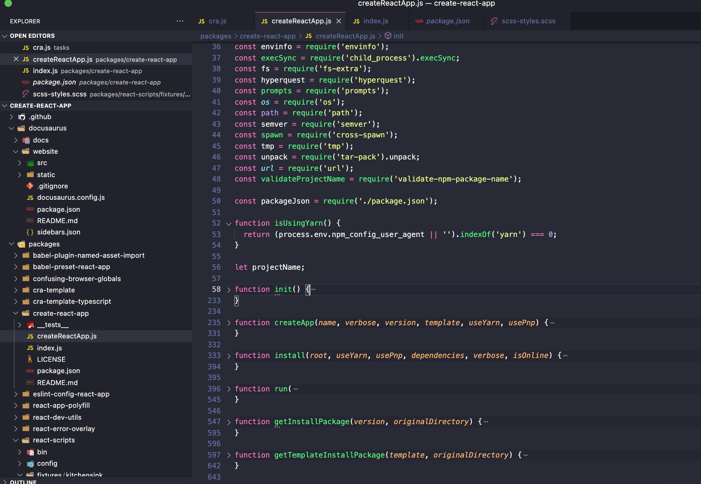

# Front End Related
### Package
- We use UglifyJS to minify code, as it removes whitespace and unnecessary characters within a file to make it smaller and thus, load faster. It also provide options to remove unreachable code and reduce variables/property characters. However Uglify will not auto obfuscate your code, it has mangle options and you need to manually set it, also remember to close warning and sorceMap on Prod.  
- For versions,  DefinePlugin replaces variables in code with other values or expressions at compile time, so we add it at the bottom of plugins to replace versionHash, env options and path. And we change output chunkFileName to include versionHash, which will update chunk name each time we deploy for version management and avoid cache-control issue(default will be no-cache and return 304 Not Modified when assets name don't change [See more: http caching](https://developer.mozilla.org/en-US/docs/Web/HTTP/Caching)).  
- On devServer, we can set allowed hosts and headers (control access methods like get post put delete, origin and headers like x-requested-with, content-type). And we can set proxy for api and static request, direct them to target server and use bypass to config certain url.   
- Before webpack V4 we used CommonsChunkPlugin, chunks (and modules imported inside them) were connected by a parent-child relationship in the internal webpack graph. The CommonsChunkPlugin was used to avoid duplicated dependencies across them. Common chunked file can be loaded once initially, and stored in cache for later use.  Now we have optimization.splitChunks, Webpack will automatically split chunks if it's shared or too large, and provide severel options including which chunk to optimize, minChunk, chacheGroups and so on.    
- We use webpack-split-by-path to split chunk, we don't use webpack auto split since we have some dynamic dependency, we require some JS file manually. Webpack-split-by-path will package all path array files to named chunk, and it starts from the top, files will only been packaged once, so we can package base chunk at the bottom, and the index.js will only load a small scale base chunk.  
[See more: Webpack official code-splitting](https://webpack.js.org/guides/code-splitting/ )  
[See more: The 100% correct way to split your chunks with Webpack](https://medium.com/hackernoon/the-100-correct-way-to-split-your-chunks-with-webpack-f8a9df5b7758 )  
- Besides, we use bundle analyzer to analyze each chunk's size and try to split large ones. And use copyWebpackPlugin to move images/font folder to build path(Starting in version 3.0.0, copyWebpackPlugin stopped using filesystem to copy files and depending on webpack's in-memory fs, when use webpack-dev-server, you need to force it with the write-file-webpack-plugin.) And we need license-webpack-plugin to outputs licenses from 3rd party libraries to a file, this can also be used to filter certain license type like MIT. LoaderOptionsPlugin is added to set minimize and debug options base on env.
- For small scale projects, like PDF UI generator, we can direcly use Create React App, it will auto config a react application with all react dependencies, scss support, eslint/prettier and even unit testing driven by Jest. When you run create-react-app it goto node.js file tasks/cra.js, which use fs, path and child_process to add customized packages into packageJson, and then it will call create-react-app/index.js that only checks your node version and init createReactApp.js.  They use semver to check package version(format legal check, themplate version supprt check and compare to latest), write seperate logic for yarn, run default or customized template, then use node comand to install all packages.  However there are many disadvantages, especially you can't use webpack.config.js, you have to use libraries like customize-cra or react-app-rewired which have limited capabilities to change build settings.  I did write config-overrides.js to change build path since I need to seperate package for header and footer, the syntax is different with webpack and they don't provide a nice doc. So don't use CRA when you need to custom build config.

### Routing
We use marionette route on old project and use react route on next-stage.
### Security
- We didn't use restful API, and currently there's only 200 code on old project, all error messsages will include in success message. This is mainly cause by the secure concern, since if we provide detailed error message on error code including 500/403, the attacker might infer our file stucture or find security holes. But from my option, we can just give a cutomized not found page, which already exist, no matter the error code, and follow restful API.
- We did add human identification to avoide dos attack, and doing encryption for user info(HTTPs itself only encrypt public key). For CSRF, we use tocken solution, on all reset operations we will add csrf tocken for few incoming instruct through Ajax setup (we can also add set-cookie:same site, or check origin/refer header, or double check the cookie). Also on server side we have white list.
- For cookieXSS, which attacker might include JS files though cookie, we can simply set cookie to HTTPs only, and block Javascript access cookie. For HTTP man-in-the-middle attack, we did have a VPN on company level, multi-factor authentication also works.
- Besides, all input length should be limited and FE should check the input type and validity before send it to BE. Also we should limit URL length on cloud level, and avoide store sensitive message on FE, expecially on cookie storage, since it is send to BE each request.
### Unit testing
 - We using Karma(execute JavaScript code in multiple real browsers using istanbul), mocha, chai and react test library. The reason we don't choose Jest, is to support marionette/backbone.
 - Usually we only need to use expect and assert to check result, describe testing functions and use 'it' for each conditions. To test UI, we render react with @testing-library/react, and use beforeEach/ afterEach hooks to create testing dom, which will run on each condition. Inside chai.js expect() method, we can write all dom operartions, even syntax not supported by chai.js. We also use snapshot to track UI changes. Persionally I don't like chai, since it even not support Map, Set or WeakMap, and we have to do work around.
 - We can use renderHook that has three return values: result, rerender, unmount, to test react customized hooks. However rerender can't been called after unmount, and it don't contain any destory method, so I have to test some conditions on components use this hook.
 - Also we have sinon to check if a callback is trigged, and fireEvent to mock most events. If you want to test a result after few mimutes, you can create Promise contains setTimeOut and use async await.

